# Bash-Scripting
# Lab 1

### Using sed utility
#### 1- Display the lines that contain the word “lp” in /etc/passwd file.

#### 2- Display /etc/passwd file except the third line.

#### 3- Display /etc/passwd file except the last line.

#### 4- Display /etc/passwd file except the lines that contain the word “lp”.

#### 5- Substitute all the words that contain “lp” with “mylp” in /etc/passwd file.

### Using awk utility
#### 1- Print full name (comment) of all users in the system.

#### 2- Print login, full name (comment) and home directory of all users.( Print each line preceded by a line number)

#### 3- Print login, uid and full name (comment) of those uid is greater than 500

#### 4- Print login, uid and full name (comment) of those uid is exactly 500

#### 5- Print line from 5 to 15 from /etc/passwd

#### 6- Change lp to mylp

#### 7- Print all information about greatest uid.

#### 8- Get the sum of all accounts id’s.

# Lab 2
### 1. Create a script that asks for user name then send a greeting to him.
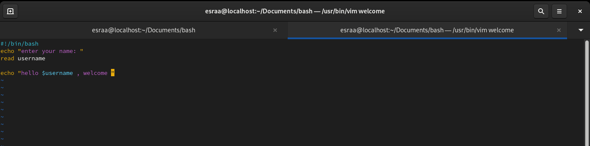
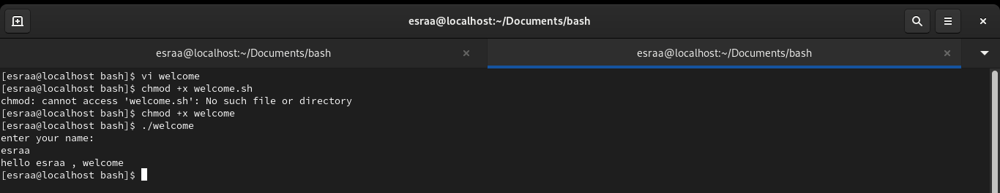

### 2. Create a script called s1 that calls another script s2 where:
#### a. In s1 there is a variable called x, it's value 5
#### b. Try to print the value of x in s2 by two different ways.
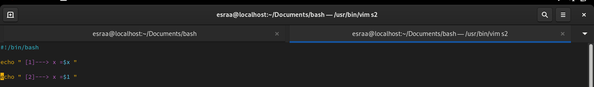
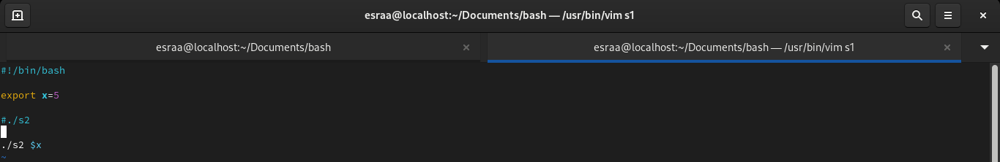
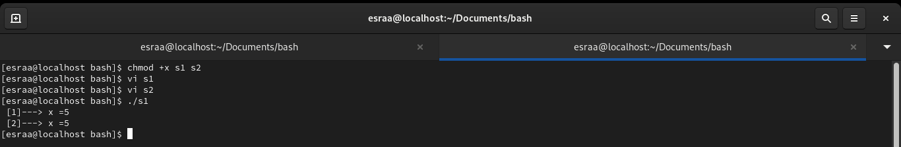

### 3. Create a script called mycp where:
#### a. It copies a file to another
#### b. It copies multiple files to a directory.
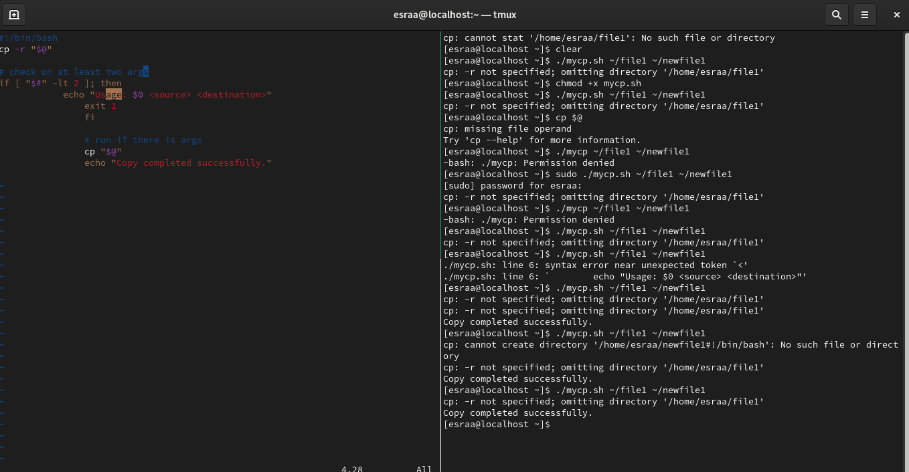

### 4. Create a script called mycd where:
#### a. It changed directory to the user home directory, if it is called without arguments.
#### b. Otherwise, it change directory to the given directory.
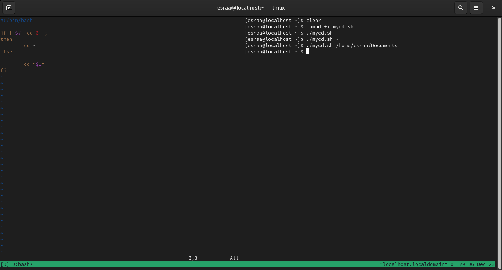

### 5. Create a script called myls where:
#### a. It lists the current directory, if it is called without arguments.
#### b. Otherwise, it lists the given directory.
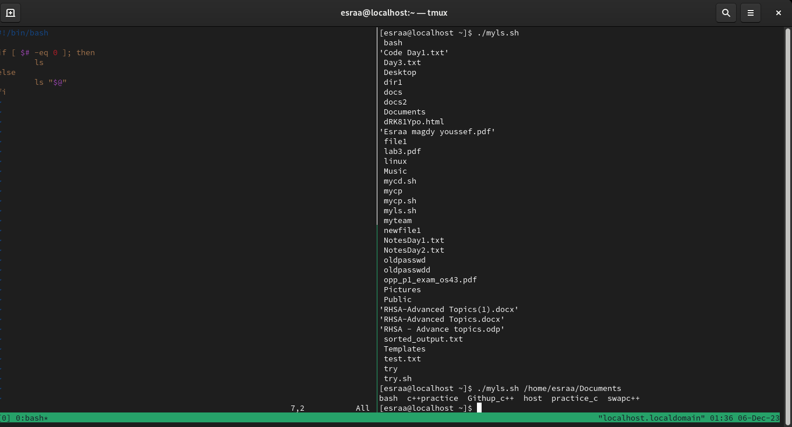

### 6. Enhance the above script to support the following options individually:
#### a. –l: list in long format
#### b. –a: list all entries including the hiding files.
#### c. –d: if an argument is a directory, list only its name
#### d. –i: print inode number
#### e. –R: recursively list subdirectories
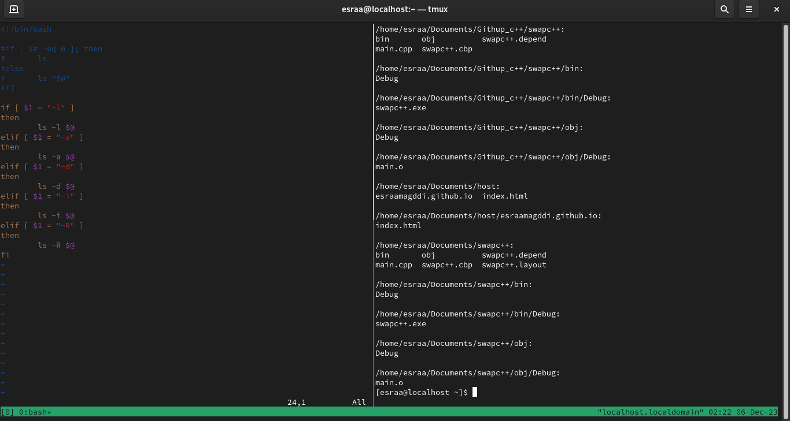

# Lab 3
# Shell Scripting Examples

## 1. mycase Script

Write a script called `mycase` using the `case` utility to check the type of character entered by a user:

- Upper Case.
- Lower Case.
- Number.
- Nothing.
  
  

## 2. Enhanced mycase Script

Enhance the previous script to check the type of string entered by a user:

- Upper Cases.
- Lower Cases.
- Numbers.
- Mix.
- Nothing.
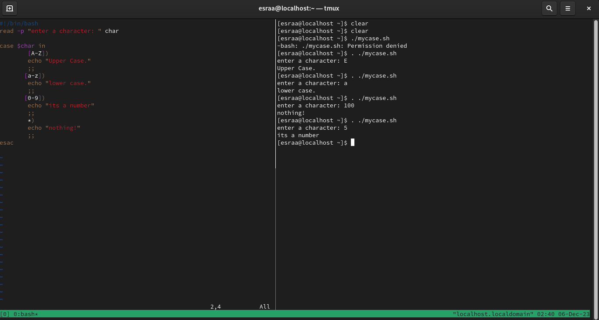

## 3. mychmod Script

Write a script called `mychmod` using the `for` utility to give execute permission to all files and directories in your home directory.
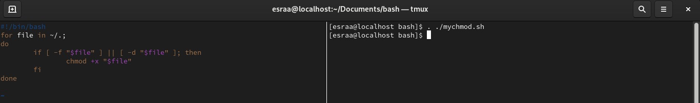

## 4. mybackup Script

Write a script called `mybackup` using the `for` utility to create a backup of only files in your home directory.
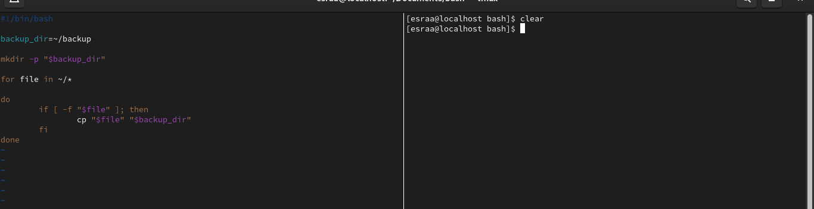

## 5. mymail Script

Write a script called `mymail` using the `for` utility to send an email to all users in the system. Note: write the mail body in a file called `mtemplate`.
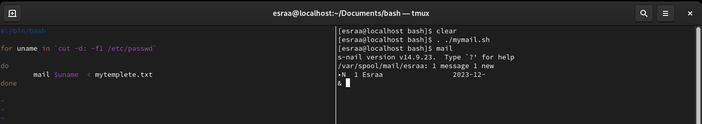

## 6. chkmail Script

Write a script called `chkmail` to check for new emails every 10 seconds. Note: emails are saved in `/var/mail/username`.
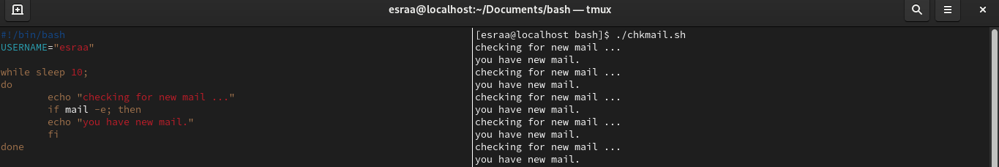

