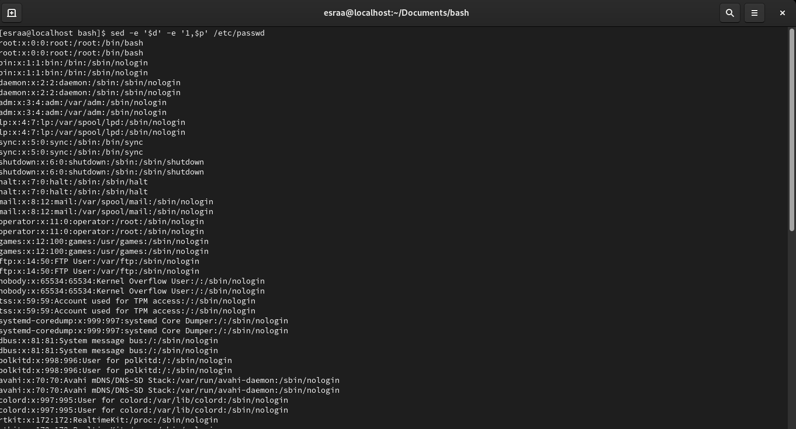

# Bash-Scripting
# Lab 1

### Using sed utility
#### 1- Display the lines that contain the word “lp” in /etc/passwd file.

#### 2- Display /etc/passwd file except the third line.

#### 3- Display /etc/passwd file except the last line.

#### 4- Display /etc/passwd file except the lines that contain the word “lp”.

#### 5- Substitute all the words that contain “lp” with “mylp” in /etc/passwd file.

### Using awk utility
#### 1- Print full name (comment) of all users in the system.

#### 2- Print login, full name (comment) and home directory of all users.( Print each line preceded by a line number)

#### 3- Print login, uid and full name (comment) of those uid is greater than 500

#### 4- Print login, uid and full name (comment) of those uid is exactly 500

#### 5- Print line from 5 to 15 from /etc/passwd

#### 6- Change lp to mylp

#### 7- Print all information about greatest uid.

#### 8- Get the sum of all accounts id’s.

# Lab 2
### 1. Create a script that asks for user name then send a greeting to him.

### 2. Create a script called s1 that calls another script s2 where:
#### a. In s1 there is a variable called x, it's value 5
#### b. Try to print the value of x in s2 by two different ways.

### 3. Create a script called mycp where:
#### a. It copies a file to another
#### b. It copies multiple files to a directory.
### 4. Create a script called mycd where:
#### a. It changed directory to the user home directory, if it is called without arguments.
#### b. Otherwise, it change directory to the given directory.
### 5. Create a script called myls where:
#### a. It lists the current directory, if it is called without arguments.
#### b. Otherwise, it lists the given directory.
### 6. Enhance the above script to support the following options individually:
#### a. –l: list in long format
#### b. –a: list all entries including the hiding files.
#### c. –d: if an argument is a directory, list only its name
#### d. –i: print inode number
#### e. –R: recursively list subdirectories
## Bonus: enhance the above script to support the following Synopsis:
myls -option1 –option2\
myls –option2 –option1\
myls –option1option2\
myls –option2option1
### 7. Create a script called mytest where:
#### a. It check the type of the given argument (file/directory)
#### b. It check the permissions of the given argument (read/write/execute)
### 8. Create a script called myinfo where:
#### a. It asks the user about his/her logname.
#### b. It print full info about files and directories in his/her home directory
#### c. Copy his/her files and directories as much as you can in /tmp directory.
#### d. Gets his current processes status.
